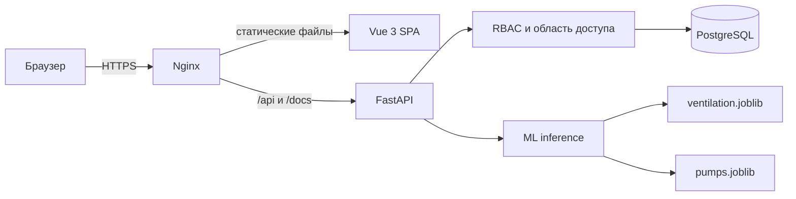
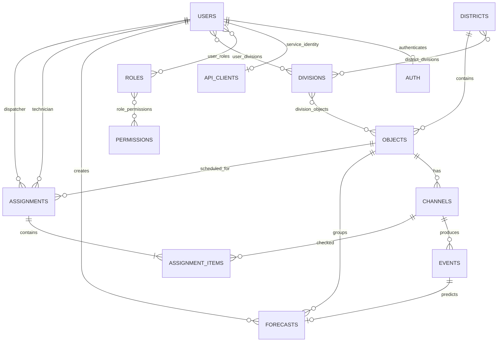

# Задача #8 | Департамент жилищнокоммунального хозяйства | ЛЦТ 26

Сервис прогнозирования аварий и управления ремонтными работами инженерных коллекторов Москвы — веб-система контроля инженерного оборудования. Она объединяет объекты, датчики и показания, показывает состояние на карте и дашборде, прогнозирует неисправность датчика на ближайшие 30 дней, позволяет диспетчеру назначить проверку технику и формирует отчёты.

Доступ ограничивается RBAC и подразделениями. Сотрудник видит объекты закреплённых за ним подразделений; администратор видит всю систему.

## Возможности

- карта объектов Москвы и цветовая индикация состояния датчиков;
- объекты, каналы и показания с поиском, фильтрами и пагинацией;
- дашборд и журнал прогнозов с фильтрацией по датам и риску;
- запуск ML-прогноза при поступлении нового показания;
- задания техникам на объект или конкретный датчик;
- отдельное завершение проверки каждого датчика;
- экспорт объектов, показаний, заданий и прогнозов в CSV, XLSX и PDF;
- управление пользователями, ролями, разрешениями, подразделениями и районами;
- JWT-аутентификация и территориальное ограничение данных.

## Архитектура

Приложение состоит из Vue SPA, REST API на FastAPI, PostgreSQL и локальных ML-моделей. Frontend обращается к `/api`; backend применяет правила доступа до выполнения предметного запроса.



Структура backend:

- `app/api` — HTTP-маршруты и проверка разрешений;
- `app/schemas` — Pydantic-схемы запросов и ответов;
- `app/dbapi/models` — SQLAlchemy-модели и CRUD;
- `app/rbac.py` — выборки в области доступа пользователя;
- `app/ml_models` — загрузка моделей и расчёт прогноза;
- `alembic/versions` — миграции схемы и начальные данные RBAC;
- `frontend/src` — Vue-приложение, маршруты, хранилища и экраны;
- `scripts` — заполнение территорий и пользователей.

## Стек

| Слой | Технологии |
| --- | --- |
| Backend | Python 3.13, FastAPI, Uvicorn, Pydantic 2 |
| База данных | PostgreSQL, SQLAlchemy 2 async, asyncpg, Alembic |
| Безопасность | JWT (`python-jose`), bcrypt, RBAC |
| ML | scikit-learn, NumPy, joblib, threadpoolctl |
| Отчёты | openpyxl, ReportLab, CSV |
| Frontend | Vue 3, PrimeVue 4, PrimeIcons, Pinia, Vue Router |
| Карта и сборка | MapLibre GL JS, OpenStreetMap, Vite 7 |
| Тесты | pytest, pytest-asyncio, HTTPX |

## Локальный запуск

Потребуются Python 3.13+, [uv](https://docs.astral.sh/uv/), Node.js 20+ и PostgreSQL.

### Backend

Создайте базу PostgreSQL, затем выполните:

```bash
cp .env.example .env
uv sync
uv run alembic upgrade head
```

Настройте `.env`:

```dotenv
PROJECT_NAME=MK Sensors
SECRET_KEY=replace-with-at-least-32-random-characters
DB_USER=postgres
DB_PASSWORD=postgres
DB_HOST=localhost
DB_PORT=5432
DB_NAME=hackaton
CORS_ALLOWED_ORIGINS=["http://localhost:5173"]
```

`SECRET_KEY` должен быть случайной строкой не короче 32 символов.

В корне проекта расположен дамп БД postgres `hackaton.dump`

Для разворачивания на локальной машине необходимо сделать следующее:

```bash
createdb -U postgres hackaton
pg_restore -h localhost -U postgres -d hackaton -j 4 hackaton.dump
```

Вы получите загруженную БД со всеми сохранёнными данными

Для всех пользователей в указанной БД пароль по умолчанию: `qwerty12345`

Запустите API:

```bash
make dev-backend
# либо uv run uvicorn main:app --reload --port 8000
```

### Frontend

В другом терминале:

```bash
make dev-frontend
# либо поочерёдно команды ниже
cd frontend
cp .env.example .env.development
npm ci
npm run dev
```

Интерфейс откроется на `http://localhost:5173`, API — на `http://localhost:8000/api`.

| Переменная frontend | Назначение |
| --- | --- |
| `VITE_API_BASE_URL` | префикс API, обычно `/api` |
| `VITE_BACKEND_URL` | backend для dev proxy |
| `VITE_PORT` | порт Vite |
| `VITE_BASE_PATH` | базовый URL SPA |
| `VITE_MAP_TILE_URL` | шаблон URL картографических тайлов |


## API и Swagger

После запуска backend доступны:

- Swagger UI — `http://localhost:8000/docs`;
- ReDoc — `http://localhost:8000/redoc`;
- OpenAPI JSON — `http://localhost:8000/openapi.json`;
- health check — `http://localhost:8000/api/health`.

Все публичные методы имеют русские заголовки и описания. Каталог находится в `app/openapi.py`; приложение сообщит об ошибке при запуске, если новый `/api`-маршрут добавлен без документации.

Для пользовательских методов выполните `POST /api/login`, скопируйте `access_token`, нажмите **Authorize** в Swagger и вставьте токен.

```bash
curl -X POST http://localhost:8000/api/login \
  -H 'Content-Type: application/json' \
  -d '{"email":"admin@example.com","password":"qwerty12345"}'
```

Автоматические источники передают показания без входа пользователя:

```bash
curl -X POST http://localhost:8000/api/ingest/forecasts \
  -H 'Content-Type: application/json' \
  -H 'X-Sensor-Token: <service-token>' \
  -d '{"channel_id":8812,"event_at":"2026-09-24T10:30:00+03:00","is_alarm":false,"sensor_value":"Исправен"}'
```

Создайте первый токен после применения миграций:

```bash
uv run python -m app.cli.create_api_client --name sensors
```

Команда выводит открытый токен один раз. Повторный запуск с тем же именем заменяет токен; предыдущий сразу перестаёт действовать. В базе хранится только SHA-256-хеш. Техническая учётная запись не имеет пароля, не является сотрудником и не показывается в разделе администрирования.

## Роли и права

В интерфейсе используются четыре рабочие роли. Новая учётная запись не получает роль автоматически: администратор назначает ей подразделение и рабочую роль.

| Возможность | Диспетчер | Техник | Руководитель | Администратор |
| --- | :---: | :---: | :---: | :---: |
| Объекты, каналы, показания, прогнозы и задания | ✓ | ✓ | ✓ | ✓ |
| Карта | ✓ | ✓ | ✓ | ✓ |
| Аналитический дашборд | ✓ |  |  | ✓ |
| Сводный дашборд |  |  | ✓ | ✓ |
| Создание задания технику | ✓ |  |  | ✓ |
| Выполнение назначенного задания |  | ✓ |  | ✓ |
| Ручной запуск прогноза | ✓ |  | ✓ | ✓ |
| Верификация прогноза и решение | ✓ |  |  | ✓ |
| Риски и предупреждения | ✓ |  | ✓ | ✓ |
| Заявки, обслуживание и ремонты |  | ✓ | просмотр | ✓ |
| Экспорт отчётов | ✓ | ✓ | ✓ | ✓ |
| Пользователи, роли и разрешения |  |  |  | ✓ |
| Районы, подразделения и области доступа |  |  |  | ✓ |
| Аудит и системные параметры |  |  |  | ✓ |

Фактические права хранятся в `permissions` и связываются с ролями через `role_permissions`:

- данные: `object.view/edit`, `channel.view/edit`, `event.view`;
- интерфейс: `dashboard.analytics`, `dashboard.summary`, `map.view`;
- прогнозы: `forecast.view/create/verify/decide`, `risk.view`, `warning.view`;
- задания: `assignment.view/create/complete`;
- работы: `ticket.*`, `maintenance.view`, `repair.view`, `incident.view`;
- отчёты: `report.export_pdf`, `report.export_xlsx`;
- управление: `access.manage`, `user.*`, `role.*`, `permission.*`, `audit.view`, `settings.view`.

Роль определяет действие, область доступа — строки данных:

- администратор видит все объекты;
- остальные видят объекты своих подразделений;
- каналы, события, прогнозы и задания доступны через доступный объект;
- техник видит только назначенные ему задания;
- пользователь без подразделения не видит предметных объектов;
- область конкретной роли можно дополнительно задать по подразделениям, районам или объектам.

Несколько ролей и подразделений объединяют разрешения и область доступа.

## Структура базы данных

Все ORM-таблицы имеют `created_at` и `updated_at` в формате Unix timestamp.

| Таблица | Назначение |
| --- | --- |
| `users`, `auth` | профиль и данные входа, связь 1:1 |
| `api_clients` | хеши сервисных токенов и технические учётные записи для датчиков |
| `roles`, `permissions` | справочники RBAC |
| `user_roles`, `role_permissions` | связи ролей и разрешений |
| `divisions`, `districts` | подразделения и районы |
| `district_divisions` | подразделения района |
| `division_objects` | объекты подразделения |
| `user_divisions` | места работы пользователя |
| `user_role_divisions/districts/objects` | область конкретной роли пользователя |
| `objects` | объекты, район, тип, уровень и координаты |
| `channels` | датчики/каналы объекта |
| `events` | показания каналов |
| `forecasts` | прогноз для события и канала |
| `assignments` | задание технику на объект и дату |
| `assignment_items` | датчики задания и статус каждой проверки |



Объект может принадлежать нескольким подразделениям. Сочетание объекта и даты задания уникально. При удалении сотрудника его данные входа и RBAC-связи удаляются, а обезличенный профиль сохраняется для исторических заданий и прогнозов.

## ML-прогноз

`POST /api/forecasts` проверяет доступ к каналу, сохраняет событие, выбирает модель, использует историю неисправностей и сохраняет прогноз.

Используются `app/ml_models/ventilation.joblib` и `app/ml_models/pumps.joblib`. Нужные для расчёта метаданные находятся внутри joblib bundle. `*_metadata.json` — читаемое описание обученной модели; inference-код их не загружает.

Модели кешируются через `lru_cache`, поэтому после замены `.joblib` перезапустите backend. Bundle должен содержать ожидаемые ключи: `estimator`, `features`, `channel_codes`, `registry` и параметры окна и порога. Для канала вне моделей событие сохраняется, а прогноз получает `unsupported_channel` без выдуманной вероятности.

## Отчёты

`GET /api/reports/{dataset}/{file_format}` поддерживает `objects`, `events`, `assignments`, `forecasts`:

- CSV — потоково, без ограничения строк;
- XLSX — до 1 000 000 строк;
- PDF — до 10 000 строк.

Выгрузка соблюдает фильтры и область доступа. XLSX и PDF содержат заголовок, время и параметры фильтров. Одна проверка датчика занимает одну строку отчёта.

## Проверки

```bash
make test
cd frontend && npm run build
```

## Развёртывание

Вариант без контейнеров: PostgreSQL, systemd для API и Nginx для HTTPS, SPA и reverse proxy.

```bash
git clone <repository-url> /opt/mk_sensors
cd /opt/mk_sensors
cp .env.example .env
# заполните production-параметры
uv sync --frozen
uv run alembic upgrade head
cd frontend
npm ci
npm run build:production
```

Production `.env` должен содержать уникальный `SECRET_KEY`, отдельного пользователя PostgreSQL и публичный origin в `CORS_ALLOWED_ORIGINS`. Пароли и ключи не храните в Git.

Пример `/etc/systemd/system/mk-sensors.service`:

```ini
[Unit]
Description=MK Sensors API
After=network.target postgresql.service

[Service]
User=mk-sensors
Group=mk-sensors
WorkingDirectory=/opt/mk_sensors
EnvironmentFile=/opt/mk_sensors/.env
ExecStart=/usr/local/bin/uv run uvicorn main:app --host 127.0.0.1 --port 8000 --workers 2
Restart=on-failure

[Install]
WantedBy=multi-user.target
```

Путь к `uv` уточните командой `command -v uv`. Пример Nginx:

```nginx
server {
    listen 443 ssl http2;
    server_name sensors.example.ru;
    root /opt/mk_sensors/frontend/dist;
    index index.html;

    location /api/ {
        proxy_pass http://127.0.0.1:8000;
        proxy_set_header Host $host;
        proxy_set_header X-Forwarded-Proto $scheme;
        proxy_set_header X-Forwarded-For $proxy_add_x_forwarded_for;
    }

    location ~ ^/(docs|redoc|openapi.json) {
        proxy_pass http://127.0.0.1:8000;
        proxy_set_header Host $host;
    }

    location / {
        try_files $uri $uri/ /index.html;
    }
}
```

После настройки TLS:

```bash
sudo systemctl daemon-reload
sudo systemctl enable --now mk-sensors
sudo nginx -t
sudo systemctl reload nginx
```

При обновлении выполните `uv sync --frozen`, `uv run alembic upgrade head`, пересоберите frontend и перезапустите API. Перед production-миграциями сделайте резервную копию PostgreSQL.

## Зарегистрированные пользователи

Список сформирован из активных учётных записей локальной базы данных. Пароль по умолчанию для всех перечисленных пользователей — `qwerty12345`.

| Роль | E-mail | Подразделение | Пароль |
| --- | --- | --- | --- |
| Администратор | `admin@example.com` | Все подразделения | `qwerty12345` |
| Руководитель | `manager@example.com` | Все подразделения | `qwerty12345` |
| Диспетчер | `disp.east@example.com` | Диспетчерская Восток | `qwerty12345` |
| Диспетчер | `disp.north@example.com` | Диспетчерская Север | `qwerty12345` |
| Диспетчер | `disp.south@example.com` | Диспетчерская Юг | `qwerty12345` |
| Диспетчер | `disp.west@example.com` | Диспетчерская Запад | `qwerty12345` |
| Техник | `tech.arb.1@example.com` | Служба эксплуатации Арбат | `qwerty12345` |
| Техник | `tech.arb.2@example.com` | Служба эксплуатации Арбат | `qwerty12345` |
| Техник | `tech.arb.3@example.com` | Служба эксплуатации Арбат | `qwerty12345` |
| Техник | `tech.bas.1@example.com` | Служба эксплуатации Басманный | `qwerty12345` |
| Техник | `tech.bas.2@example.com` | Служба эксплуатации Басманный | `qwerty12345` |
| Техник | `tech.bas.3@example.com` | Служба эксплуатации Басманный | `qwerty12345` |
| Техник | `tech.kham.1@example.com` | Служба эксплуатации Хамовники | `qwerty12345` |
| Техник | `tech.kham.2@example.com` | Служба эксплуатации Хамовники | `qwerty12345` |
| Техник | `tech.kham.3@example.com` | Служба эксплуатации Хамовники | `qwerty12345` |
| Техник | `tech.meshkras.1@example.com` | Служба эксплуатации Мещанский/Красносельский | `qwerty12345` |
| Техник | `tech.meshkras.2@example.com` | Служба эксплуатации Мещанский/Красносельский | `qwerty12345` |
| Техник | `tech.meshkras.3@example.com` | Служба эксплуатации Мещанский/Красносельский | `qwerty12345` |
| Техник | `tech.pres.1@example.com` | Служба эксплуатации Пресненский | `qwerty12345` |
| Техник | `tech.pres.2@example.com` | Служба эксплуатации Пресненский | `qwerty12345` |
| Техник | `tech.pres.3@example.com` | Служба эксплуатации Пресненский | `qwerty12345` |
| Техник | `tech.tag.1@example.com` | Служба эксплуатации Таганский | `qwerty12345` |
| Техник | `tech.tag.2@example.com` | Служба эксплуатации Таганский | `qwerty12345` |
| Техник | `tech.tag.3@example.com` | Служба эксплуатации Таганский | `qwerty12345` |
| Техник | `tech.tver.1@example.com` | Служба эксплуатации Тверской | `qwerty12345` |
| Техник | `tech.tver.2@example.com` | Служба эксплуатации Тверской | `qwerty12345` |
| Техник | `tech.tver.3@example.com` | Служба эксплуатации Тверской | `qwerty12345` |
| Техник | `tech.zamyak.1@example.com` | Служба эксплуатации Замоскворечье/Якиманка | `qwerty12345` |
| Техник | `tech.zamyak.2@example.com` | Служба эксплуатации Замоскворечье/Якиманка | `qwerty12345` |
| Техник | `tech.zamyak.3@example.com` | Служба эксплуатации Замоскворечье/Якиманка | `qwerty12345` |
